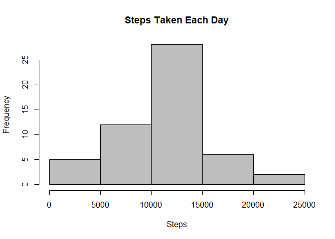
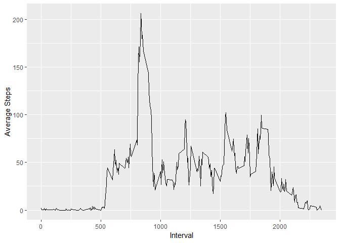
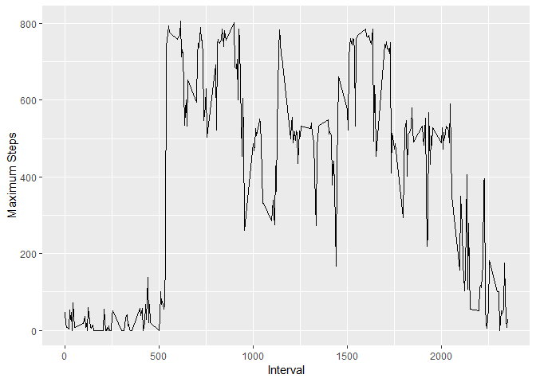
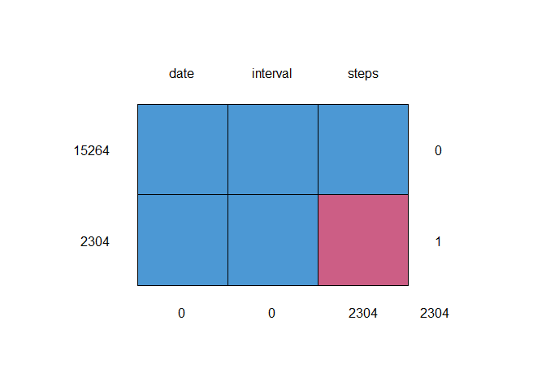
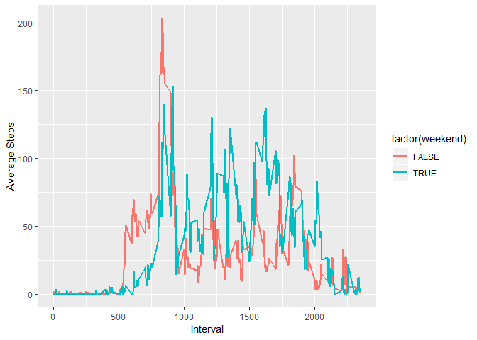

Loading and Processing the Data
-------------------------------

    setwd("C:/Users/avria/Google Drive/!LEARNING/Data Science - 05.Reproducible Research")
    download.file("https://d396qusza40orc.cloudfront.net/repdata%2Fdata%2Factivity.zip",destfile="activity.zip")
    unzip("activity.zip")
    mydata <- read.csv("activity.csv", header = TRUE)
    head(mydata)

    ##   steps       date interval
    ## 1    NA 2012-10-01        0
    ## 2    NA 2012-10-01        5
    ## 3    NA 2012-10-01       10
    ## 4    NA 2012-10-01       15
    ## 5    NA 2012-10-01       20
    ## 6    NA 2012-10-01       25

Histogram Steps Taken Each Day
------------------------------

    x <- sqldf("select date,sum(steps) as steps_total from mydata where steps not in ('NA') group by date")
    hist(x$steps, col="gray", xlab="Steps", main="Steps Taken Each Day")

Median
------

    median(mydata$steps, na.rm = TRUE) 

    ## [1] 0

Mean
----

    mean(mydata$steps, na.rm = TRUE) 

    ## [1] 37.3826

Time series plot of the average number of steps taken
-----------------------------------------------------

    mydata2 <- sqldf("select interval,avg(steps) as steps_avg from mydata where steps not in ('NA') group by interval")
    ggplot(mydata2, aes(interval, steps_avg)) + geom_line() + xlab("Interval") + ylab("Average Steps")

The 5-minute interval that, on average, contains the maximum number of steps
----------------------------------------------------------------------------

    mydata3 <- sqldf("select interval,max(steps) as steps_max from mydata where steps not in ('NA') group by interval")
    ggplot(mydata3, aes(interval, steps_max)) + geom_line() + xlab("Interval") + ylab("Maximum Steps")

    head(mydata3)

    ##   interval steps_max
    ## 1        0        47
    ## 2        5        18
    ## 3       10         7
    ## 4       15         8
    ## 5       20         4
    ## 6       25        52

Imputing Missing Value
----------------------

Shows Chart Missing Values
--------------------------

    md.pattern(mydata)

    ##       date interval steps     
    ## 15264    1        1     1    0
    ## 2304     1        1     0    1
    ##          0        0  2304 2304

Fill the Missing Value
----------------------

I assumed that the missing data are Missing at Random (MAR), which means
that the probability that a value is missing depends only on observed
value and can be predicted using them. It imputes data on a variable by
variable basis by using regression analysis to predict the value.

    tempData <- mice(mydata,m=5,maxit=5,meth='pmm',seed=500)
    completedData <- complete(tempData,1)

    summary(completedData)

    ##      steps                date          interval     
    ##  Min.   :  0.00   2012-10-01:  288   Min.   :   0.0  
    ##  1st Qu.:  0.00   2012-10-02:  288   1st Qu.: 588.8  
    ##  Median :  0.00   2012-10-03:  288   Median :1177.5  
    ##  Mean   : 33.11   2012-10-04:  288   Mean   :1177.5  
    ##  3rd Qu.:  0.00   2012-10-05:  288   3rd Qu.:1766.2  
    ##  Max.   :806.00   2012-10-06:  288   Max.   :2355.0  
    ##                   (Other)   :15840

The median is still the same, 0, however mean with imputed value is
33.11 compare with 37.38 without imputed value. The impact of imputed
missing data will decrease total number of steps.

Activity patterns between weekdays and weekends
-----------------------------------------------

    weekend <- isWeekend(mydata$date, wday = 1:5)
    mydata4 <- cbind(completedData,weekend)
    x <- sqldf("select interval,weekend,avg(steps) as steps_avg from mydata4 group by interval, weekend")

    ggplot(x, aes(interval, steps_avg, group = weekend)) + geom_line(aes(colour = factor(weekend)), size = 1) + xlab("Interval") + ylab("Average Steps") 

