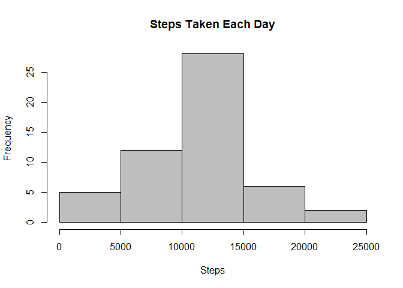
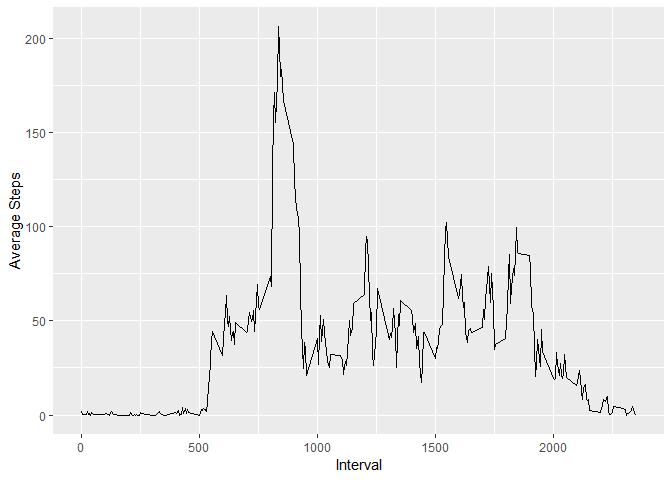
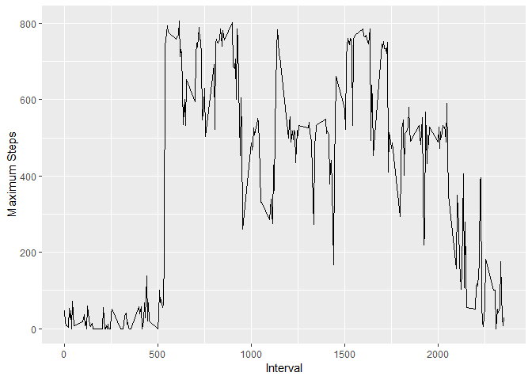
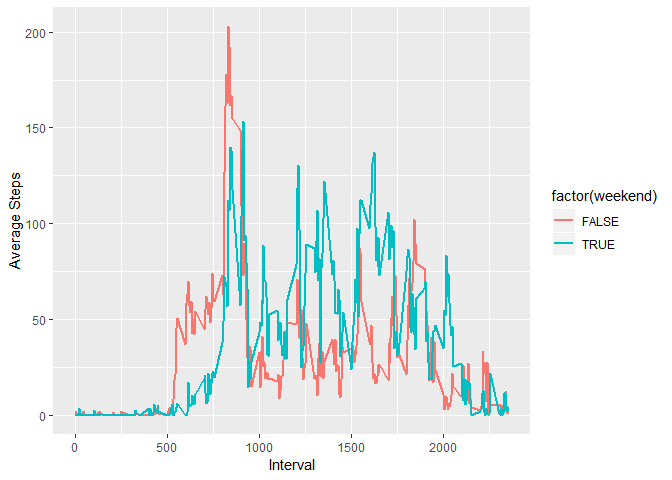

Load the Data
-------------

    setwd("C:/Users/avria/Google Drive/!LEARNING/Data Science - 05.Reproducible Research")
    mydata <- read.csv("activity.csv", header = T, stringsAsFactors = F)

Histogram Steps Taken Each Day
------------------------------

    hist(mydata$steps, col="gray", xlab="Steps", main="Steps Taken Each Day")

Median
------

    median(mydata$steps, na.rm = TRUE) 

    ## [1] 0

Mean
----

    mean(mydata$steps, na.rm = TRUE) 

    ## [1] 37.3826

Time series plot of the average number of steps taken
-----------------------------------------------------

    mydata2 <- aggregate(mydata$steps,na.rm= TRUE, list(mydata$date), mean)
    ggplot(mydata2, aes(Group.1, x, group = 1)) + geom_line() + xlab("Date") + ylab("Average Steps")

The 5-minute interval that, on average, contains the maximum number of steps
----------------------------------------------------------------------------

    mydata3 <- aggregate(mydata$steps, na.rm= TRUE, list(mydata$interval), max)
    ggplot(mydata3, aes(Group.1, x, group = 1)) + geom_line() + xlab("Interval") + ylab("Maximum Steps")

Imputing Missing Value
----------------------

Shows Chart Missing Values
--------------------------

    md.pattern(mydata)

    ##       date interval steps     
    ## 15264    1        1     1    0
    ## 2304     1        1     0    1
    ##          0        0  2304 2304

Fill the Missing Value
----------------------

    tempData <- mice(mydata,m=5,maxit=5,meth='pmm',seed=500)
    completedData <- complete(tempData,1)

    summary(completedData)

    ##      steps            date              interval     
    ##  Min.   :  0.00   Length:17568       Min.   :   0.0  
    ##  1st Qu.:  0.00   Class :character   1st Qu.: 588.8  
    ##  Median :  0.00   Mode  :character   Median :1177.5  
    ##  Mean   : 38.11                      Mean   :1177.5  
    ##  3rd Qu.: 12.25                      3rd Qu.:1766.2  
    ##  Max.   :806.00                      Max.   :2355.0

The median is still the same, 0, however mean with imputed value is
38.11 compare with 37.38 without imputed value. The impact of imputed
missing data will increase total number of steps.

Activity patterns between weekdays and weekends
-----------------------------------------------

    weekend <- isWeekend(mydata$date, wday = 1:5)
    mydata4 <- cbind(completedData,weekend)
    x <- sqldf("select interval,weekend,avg(steps) as steps_avg from mydata4 group by interval, weekend")

    ggplot(x, aes(interval, steps_avg, group = weekend)) + geom_line(aes(colour = factor(weekend)), size = 1) + xlab("Interval") + ylab("Average Steps") 

